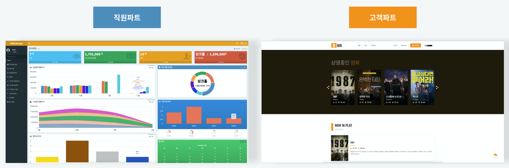
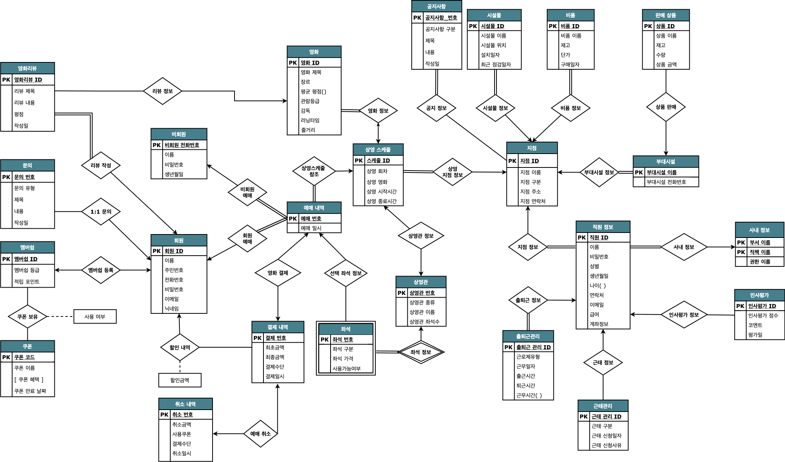

# readme.md

# DMN 멀티플렉스 영화관 통합 시스템(Team. 도미노)

## Result

---

## 개요

멀티플렉스 영화관 체인업체의 데이터베이스를 설계하고 통합정보시스템을 개발함.

 

---

## 개발환경 및 툴

---

## 협업

---

## 기능

- 고객 파트
    - 비회원(가입, 로그인, 로그아웃, 예매, 예매 취소, 결제, 예매 내역 확인)
    - 회원(가입, 로그인, 로그아웃, 멤버십, 쿠폰 사용, 예매, 예매 취소, 결제, 예매 내역 확인 )
    - 영화 리스트
    - 영화 상세 정보(영화 정보, 리뷰)
    - 극장 정보(극장별 정보, 극장별 공지, 극장별 상영스케줄)
    - 고객센터(문의, 공지사항)
    - 챗봇(간단 인사말, 극장 정보, 상영 정보)
- 직원 파트
    - 통계 페이지
    - 영화 조회
    - 상영 스케줄 관리
    - 직원 관리
    - 시설물 조회
    - 인사 평가
    - 공지사항 관리
    - 문의 관리
    

---

## **업무 분담**

---

## E-R 다이어그램

---

## Reference

- 고객파트
    - 디자인 - [https://github.com/amigosthemes/memico](https://github.com/amigosthemes/memico)
    - 3D좌석 - [https://github.com/codrops/SeatPreview](https://github.com/codrops/SeatPreview)
- 직원파트
    - 디자인 - [https://github.com/jonalxh/Flask-Admin-Dashboard](https://github.com/jonalxh/Flask-Admin-Dashboard)
